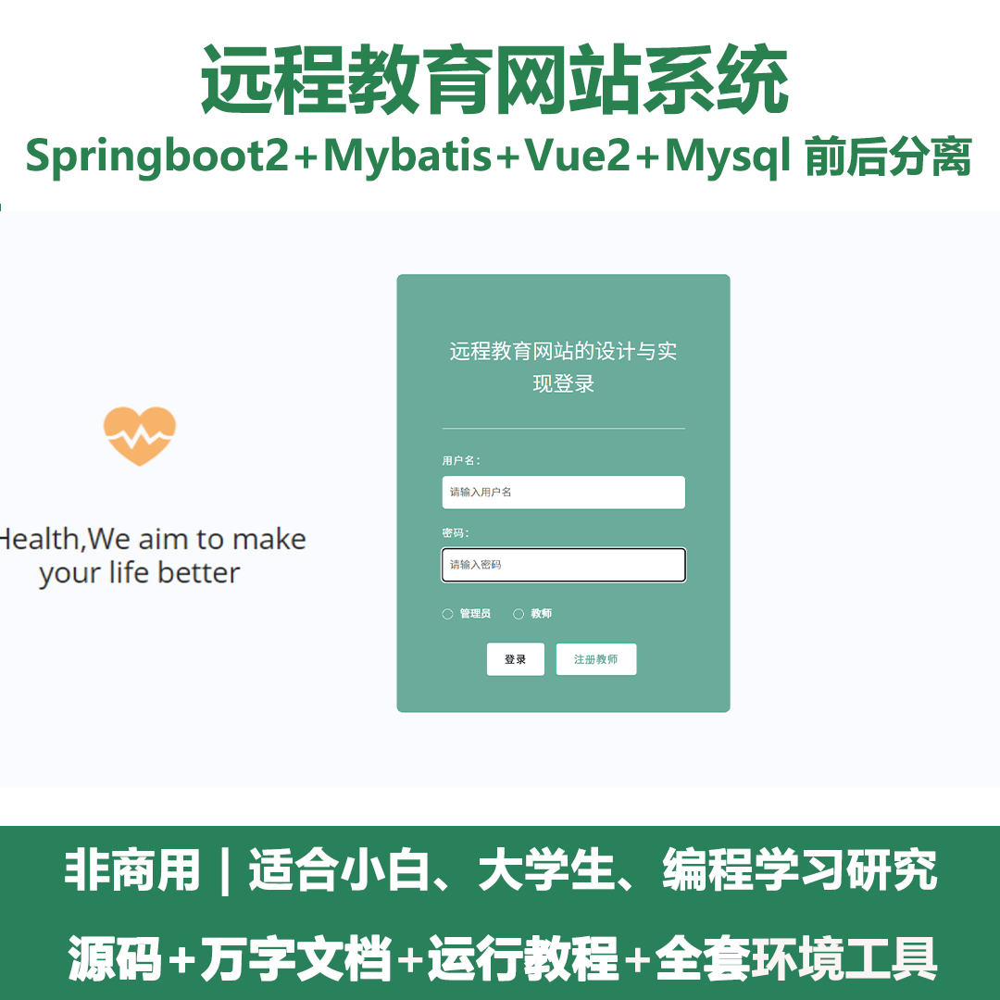
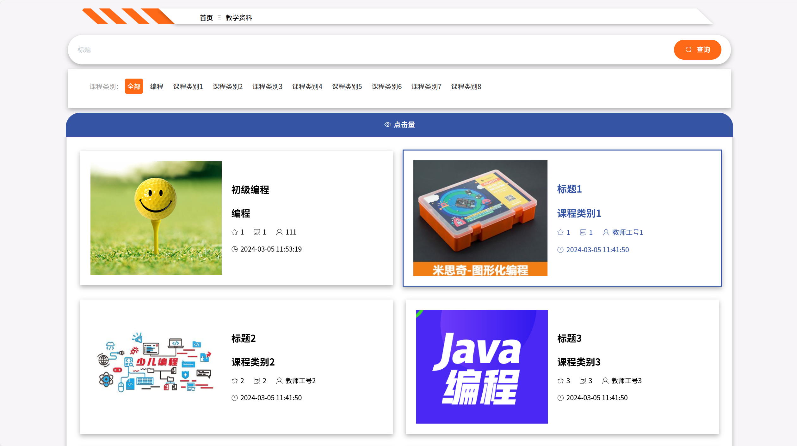
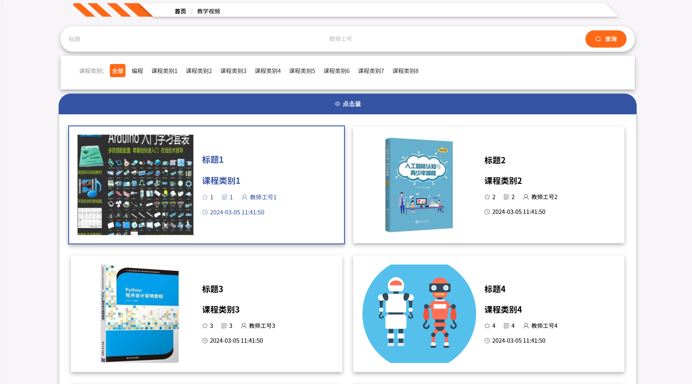
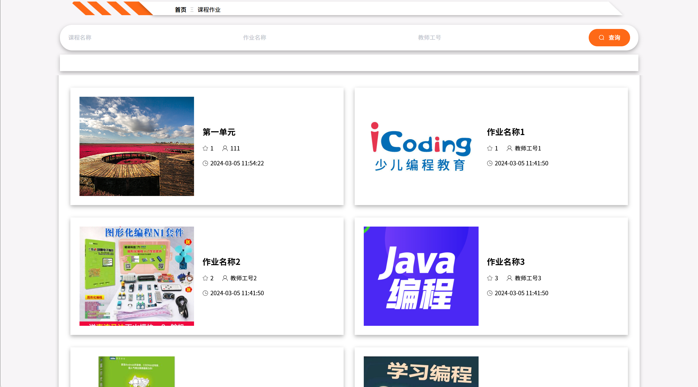
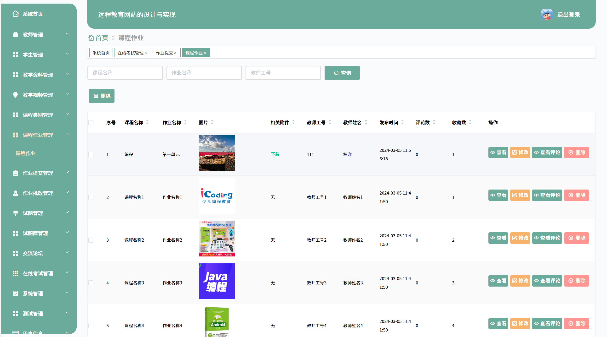
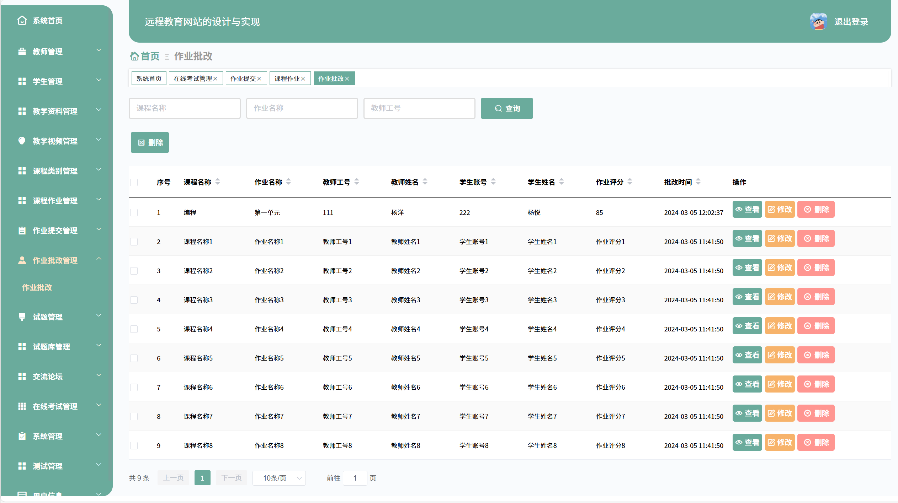
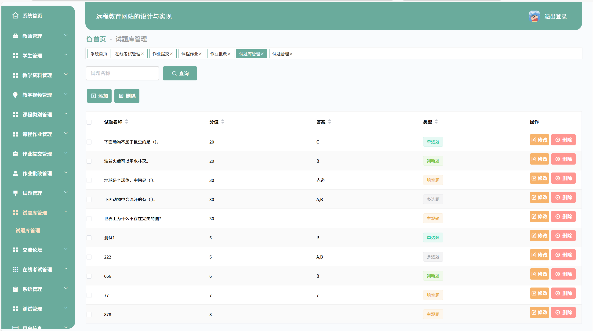
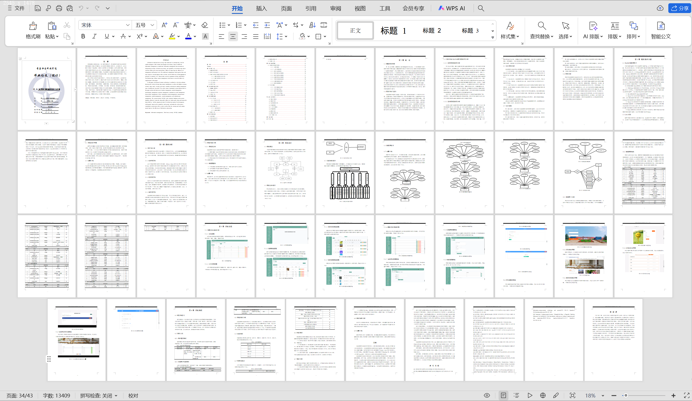

# springbootA418
springbootA418远程教育网站系统+LW
 
## 查看主页获取源码

### 一、关键词

在线教育平台，网络教育系统，线上学习平台
 

### 二、作品包含

源码+数据库+设计文档万字+全套环境和工具资源+部署教程

 

### 三、项目技术

前端技术：Html、Css、Js、Vue2.0、Element-ui 
后端技术：Java、SpringBoot2.0、MyBatis

  

 

### 四、运行环境（以下版本亲测，其他版本未知，请自测）

开发工具：IDEA/eclipse  + VSCODE

数据库：MySQL5.7（最低要5.7版本）

数据库管理工具：Navicat10以上版本

环境配置软件： JDK1.8 + Maven3.6.3

前端Nodejs：14

浏览器：谷歌浏览器

 

### 五、项目介绍

项目编号：springbootA418

让数据内容管理不管是从录入的及时性，查看的及时性还是汇总分析的及时性，都能让正确率达到最高，管理更加的科学和便捷。本论文的远程教育网站系统实现了学生端管理、教师端管理、试卷表管理、试题表管理、考试记录表管理、答题详情表管理、在线考试系统管理、公告管理、学生管理、老师管理、管理员管理等功能。系统用到了关系型数据库中MYSQL作为系统的数据库，有效的对数据进行安全的存储，有效的备份，对数据可靠性方面得到了保证。并且程序也具备程序需求的所有功能，使得操作性还是安全性都大大提高，让远程教育网站系统更能从理念走到现实，确确实实的让人们提升信息处理效率。

### 六、运行截图

